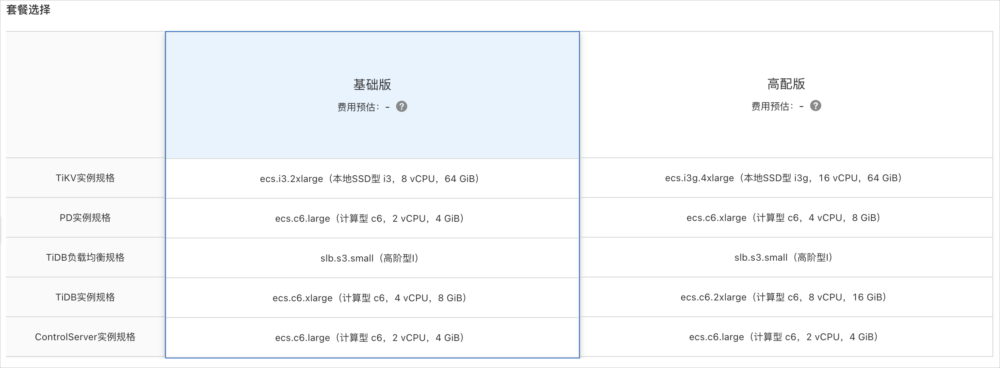
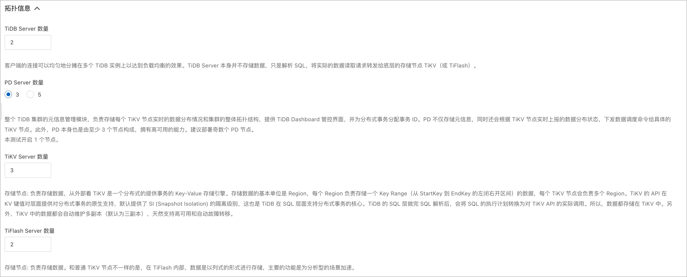
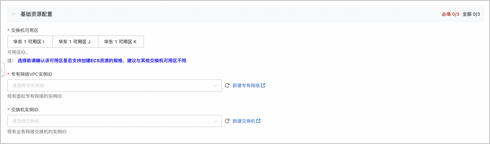
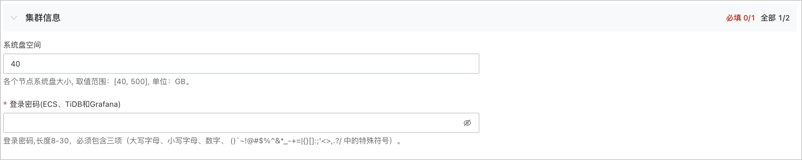
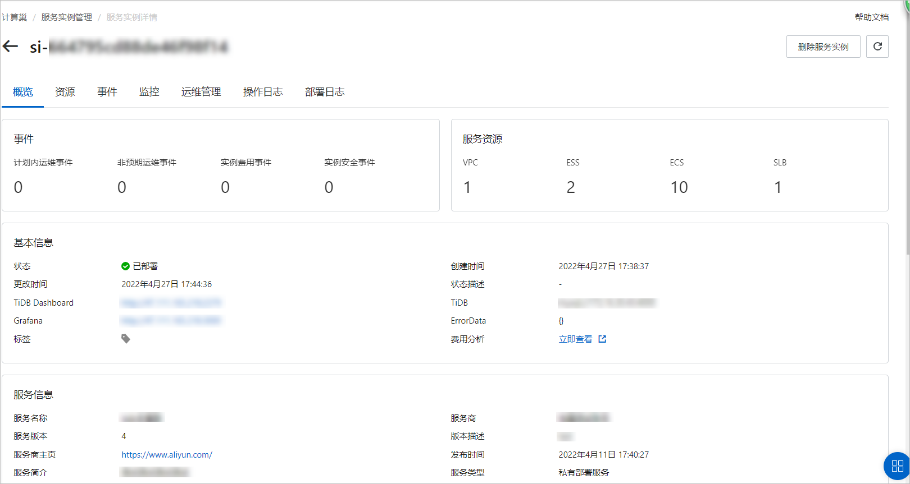
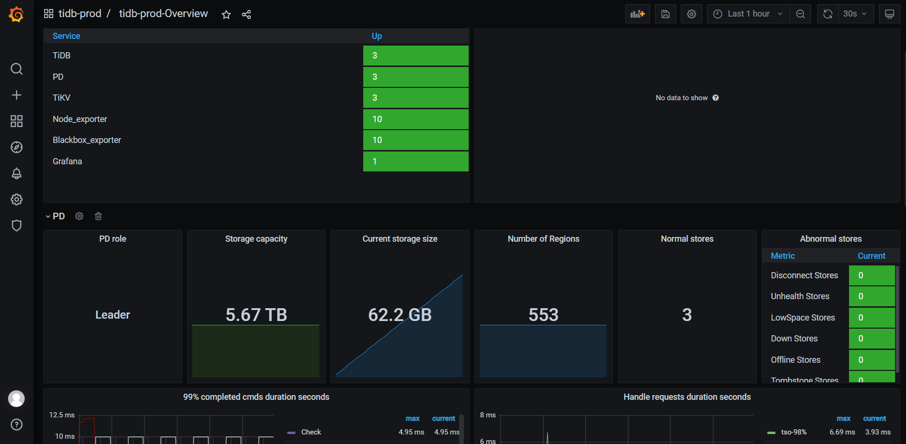
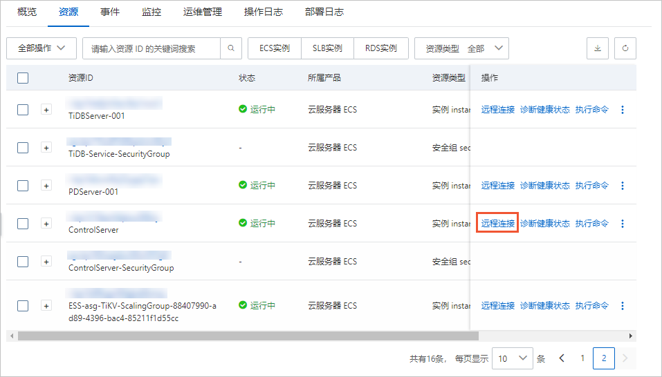
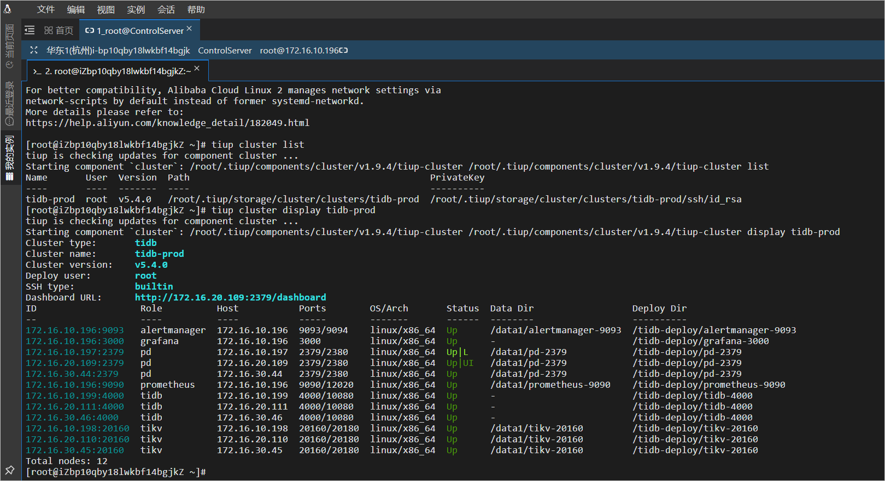
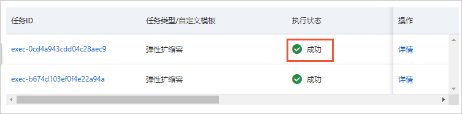
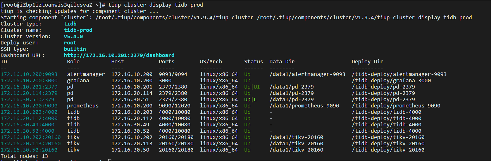

云数据库TiDB单可用区集群服务 
=====================================

>**免责声明：**本文档可能包含第三方产品信息，该信息仅供参考。阿里云对第三方产品的性能、可靠性以及操作可能带来的潜在影响，不做任何暗示或其他形式的承诺。

概述 
-----------------------

TiDB单可用区集群是基于阿里云环境部署优化，提供OLTP规模化和实时HTAP能力，具备云原生、一键扩缩容、金融级高可用、兼容MySQL协议和大数据生态等重要特性的云数据库。本文介绍了部署TiDB单可用区集群服务实例的详细说明。

RAM账号所需权限 
------------------------------

TiDB单可用区集群服务需要对ECS、ESS、SLB、VPC和OSS等资源进行访问和创建操作，若您使用RAM账号创建服务实例，则需要在创建服务实例前，对使用的RAM账号添加相应资源的权限。添加RAM权限的详细操作，请参见[为RAM用户授权](t161341.md#task-187800)。

|       权限策略名称        |        备注        |
|---------------------|------------------|
| AliyunECSFullAccess | 管理云服务器服务（ECS）的权限 |
| AliyunESSFullAccess | 管理弹性伸缩服务（ESS）的权限 |
| AliyunSLBFullAccess | 管理负载均衡服务（SLB）的权限 |
| AliyunVPCFullAccess | 管理专有网络（VPC）的权限   |
| AliyunOSSFullAccess | 管理对象存储服务（OSS）权限  |
| AliyunEIPFullAccess | 管理弹性公网IP（EIP）的权限 |

TiDB单可用区集群服务资源配置 
-------------------------------------

在部署服务实例前，您需要提前完成相关资源的准备和配置以保证服务实例能够部署成功。服务资源的基础版最小配置和高配版最小配置如下表所示。
**重要** 系统空间可根据实际情况进行调整，但是不能少于40 GB。

|     配置项     |                               基础版                               |                                                   高配版                                                    |
|-------------|-----------------------------------------------------------------|----------------------------------------------------------------------------------------------------------|
| 本地SSD ECS实例 | 3台8 vCPU 64 GiB的本地SSD ECS实例                                     | 3台16 vCPU 64 GiB的本地SSD ECS实例                                                                             |
| 计算型ECS实例    | 4台2 vCPU 4 GiB的计算型ECS实例 2台4 vCPU 8 GiB的计算型ECS实例 | 3台4 vCPU 8 GiB的计算型ECS实例 2台8 vCPU 16 GiB的计算型ECS实例 1台2 vCPU 4 GiB的计算型ECS实例 |
| 高阶型SLB负载均衡  | 1个                                                              | 1个                                                                                                       |
| EIP绑定的ECS实例 | 1个                                                              | 1个                                                                                                       |
| 系统盘         | 40 GB                                                           | 40 GB                                                                                                    |

部署流程 
-------------------------

部署步骤

1. 点击部署链接购买商品并通过商品详情中的部署链接完成部署。

2. 服务实例部署成功后，通过服务部署的SLB负载均衡访问TiDB数据库服务。

部署参数说明

用户可以通过服务商在计算巢中发布的服务部署链接，一键部署阿里云资源和服务商提供的软件。用户在创建服务实例的过程中，需要配置服务实例信息，下文介绍 TiDB 单可用区集群服务需要配置的详细参数及注意事项。

* **地域**

  请结合实际情况选择合适地域，TiDB单可用区集群服务目前适用于任何地域。
  

* **付费类型**

  支持按量付费以及预付费两种付费模式，用户可以根据实际情况进行选择。
  

* **套餐选择**

  TiDB单可用区集群服务目前支持基础版与高配版两种套餐类型，分别对应不同的机器配置和性能。
  

* **拓扑信息**

  拓扑信息区域参数已默认填写，您可以根据您的业务需求修改默认值。
  

* **基础资源配置**

  设置单可用区内VPC专有网络以及交换机资源。
  

* **集群信息**

  设置系统盘大小和登录密码。

  系统盘的默认值为：40 GB。取值范围：40\~500，单位：GB。

  登录密码，长度8-30字符，必须包含三项（大写字母、小写字母、数字、 ()\`\~!@#$%\^\&\*_-+=\|{}\[\]:;'\<\>,.?/ 中的特殊符号）。
  **重要** 此处设置的登录密码服为服务实例部署完成后ECS服务器、TiDB集群服务和TiDB 集群监控Grafana登录密码。请妥善保存。

  

* **标签和资源组**

  可根据需要对TiDB单可用区集群服务设置标签属性以及资源组归属。
  

登录TiDB集群 
-----------------------------

服务实例部署完成后，您可以登录服务的TiDB集群查看实例资源信息。

1. 登录[计算巢控制台](https://computenest.console.aliyun.com/#/vendor/cn-hangzhou/services)。

2. 在左侧导航栏，单击 **服务实例管理** 。

3. 在 **私有部署服务** 页签中，找到您创建的服务实例。

4. 单击创建的服务实例ID，进入服务实例详情页面。

5. 单击 **概览** ，在概览页签查看TiDB数据库集群信息。
   * 单击 **TiDB Dasboard** 后的IP地址，进入可视化运维监控界面，登录后可查看运维监控信息。
   
   * 单击 **Grafana** 后的IP地址，进入可视化集群性能监控界面，登录后可查看性能监控信息。

     在集群性能监控界面，单击 **TiDB-prod-Overview** ，可以查看数据库集群实例的概览。
     
   

   

6. 单击 **资源** 页签，找到实例名称为 **ControlServer** 的实例。单击 **操作** 列的 **远程连接** 。

   登录TiDB数据库管理控制台TiUP，登录控制台后查看集群信息。
   

TiDB集群扩缩容管理 
--------------------------------

若当前的业务量和数据量有明显增加或减少是，您可以根据实际情况对TiDB集群进行扩缩容操作。
**重要** 若您要进行扩缩容操作，需分别对TiDB计算节点伸缩组和TiKV储存节点伸缩组进行扩缩容。

1. 使用阿里云主账号，登录[计算巢控制台](https://computenest.console.aliyun.com/#/vendor/cn-hangzhou/services)。

2. 在左侧导航栏，单击 **服务实例管理** 。

3. 在 **私有部署服务** 页签中，找到您创建的服务实例。

4. 单击创建的服务实例ID，进入服务实例详情页面。

5. 单击 **运维管理** ，在 **应用运维** 框中，单击 **弹性扩缩容** 。

6. 在弹性扩缩容弹框中，配置扩缩容信息。

   |      配置项      |            配置说明             |
   |---------------|-----------------------------|
   | 伸缩组ID         | 选择需要进行扩缩容操作的伸缩组名称。          |
   | 伸缩规则的调整方式     | 根据规划选择扩容、缩容或调整至指定数量。        |
   | 伸缩组ECS实例调整的数量 | 填写实例调整的数量。                  |
   | OOS扮演的RAM角色   | 选择进行扩缩容操作的权限。默认使用当前账号的已有权限。 |
   | 任务描述          | 对扩缩容操作的描述。                  |

   

7. 单击 **创建** 。

   创建完成后，您可以在 **运维管理** 页签，查看扩缩容进度。
   

   伸缩组完成扩缩容后，您可以在iDB数据库集群管理控制台通过Tiup查看扩缩容信息。
   

